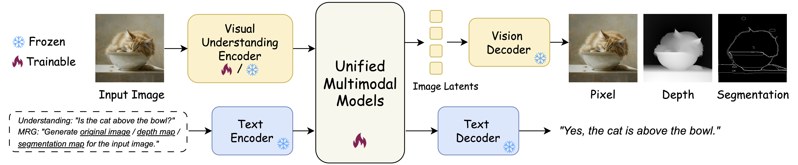

<p align="center">
  <h2 align="center"><strong>Generation Enhances Understanding in Unified Multimodal Models<br> via Multi-Representation Generation</strong></h2>

<p align="center">
  <a href="https://github.com/Sugewud">Zihan Su</a><sup>1,2†*</sup>,
  Hongyang Wei<sup>1*</sup></a>,
  Kangrui Cen<sup>3*</sup></a>,
  Yong Wang<sup>2‡</sup></a>,
  Guanhua Chen<sup>4</sup></a>,<br>
  Chun Yuan<sup>1</sup></a>,
  Xiangxiang Chu<sup>2</sup></a>
</p>

<p align="center">
  <sup>1</sup> Tsinghua University 
  <sup>2</sup> AMAP, Alibaba Group <br>
  <sup>3</sup> South China University of Technology
  <sup>4</sup> Shanghai Jiao Tong University <br>
  †Work done during internship at AMAP, Alibaba Group *Equal contribution ‡Project leadAuthor
</p>

<div align="center">

<div style="text-align: center;">
  <!-- <a href='https://sugewud.github.io/Safe-Sora-project/'></a> &nbsp; -->
  <a href='https://arxiv.org/abs/2601.21406'></a> &nbsp;
  <a href='https://huggingface.co/papers/2601.21406'></a>
  
</div>


</div>

## Release
- [01/30] Initial Preview Release 🔥 Coming Soon!

## 🔆 Introduction
We propose UniMRG, a simple yet effective architecture-agnostic post-training method for UMMs that leverages generation capabilities to enhance understanding.
<br><br> 

<br><br> 


## 📖 BibTeX
If you find our repo helpful, please consider leaving a star or cite our paper :)
```bibtex
@misc{su2026generationenhancesunderstandingunified,
      title={Generation Enhances Understanding in Unified Multimodal Models via Multi-Representation Generation}, 
      author={Zihan Su and Hongyang Wei and Kangrui Cen and Yong Wang and Guanhua Chen and Chun Yuan and Xiangxiang Chu},
      year={2026},
      eprint={2601.21406},
      archivePrefix={arXiv},
      primaryClass={cs.CV},
      url={https://arxiv.org/abs/2601.21406}, 
}
```
